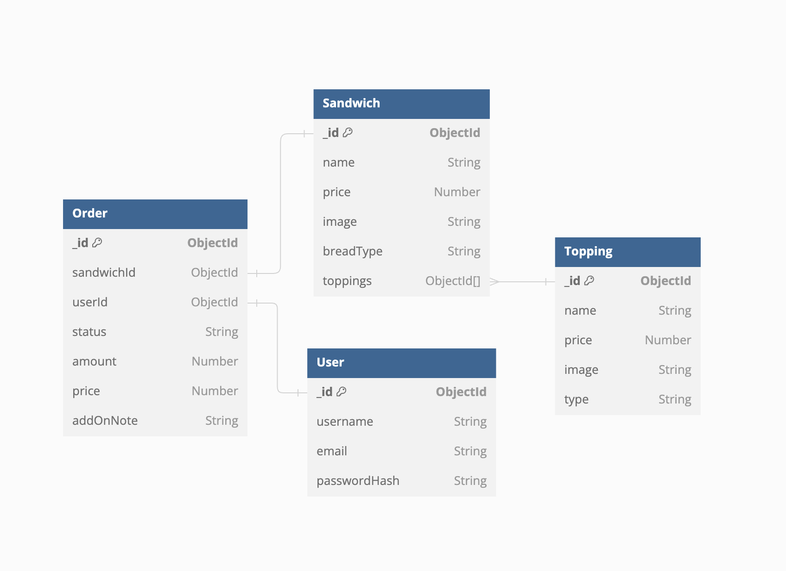

# Web Development 2 Course Project Documentation

_Written by: Xuan-An Cao & Nhan Chau_

_Last updated: 7/4/2024_

This is the temporary documentation for the Web Development 2 Course Project. The file serves as the reference logs during the project and shall be removed along with its images folder once the project is finished and the final documentation is written and included in the repository in .pdf format.

## Project Plan

### Course project group information

1. Group name: Vingroup
2. Group members:
    - Xuan-An Cao - 151454314 - an.cao@tuni.fi
    - Nhan Chau - - nhan.chau@tuni.fi
3. Group Gitlab repository: https://course-gitlab.tuni.fi/compcs510-spring2024/vingroup

### Project Timeline

| Time | Work Issues |
| ------ | ------ |
| Technical research | 24/3/2024 - 31/3/2024 |
| Backend implementation | 1/4/2024 - 12/4/2024 |
| Frontend implementation | 13/4/2024 - 26/4/2024 |
| Frontend implementation | 13/4/2024 - 26/4/2024 |
| Finalization and Documentation | 26/4/2024 - 28/4/2024 |

### Project Log

- 7/4/2024: Ready for mid-project checkin
- 6/4/2024: Created Swagger API documentation for the updated API
- 3/4/2024: Finished implementing server A backend (routes, controllers, models)
- 2/4/2024: Set up Node project for server A & improved provided project API

## System Technicality

### Server A's API

The full API functionality of server A can be accessed through: https://app.swaggerhub.com/apis/caoxantb/make-me-a-sandwich-vingroup-project/1.0.0

## Future Work

- Finalizing Docker implementation for both server A and server B
- Connect Server A and Server B using Rabbit MQ
- Implementing Frontend
